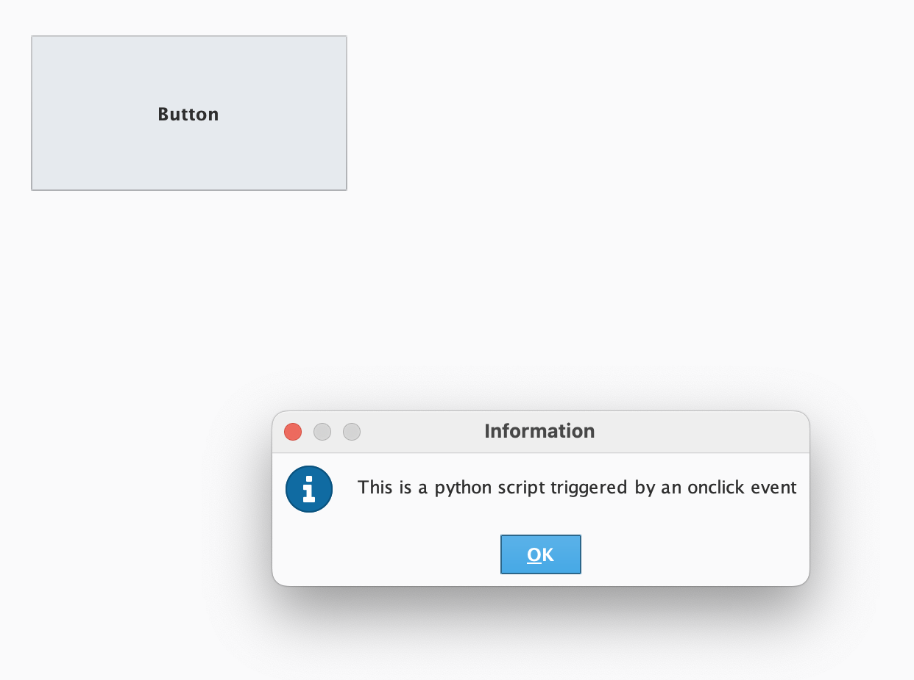
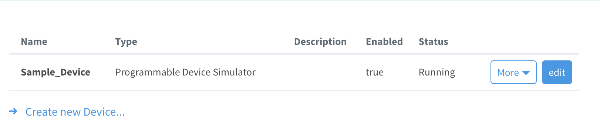
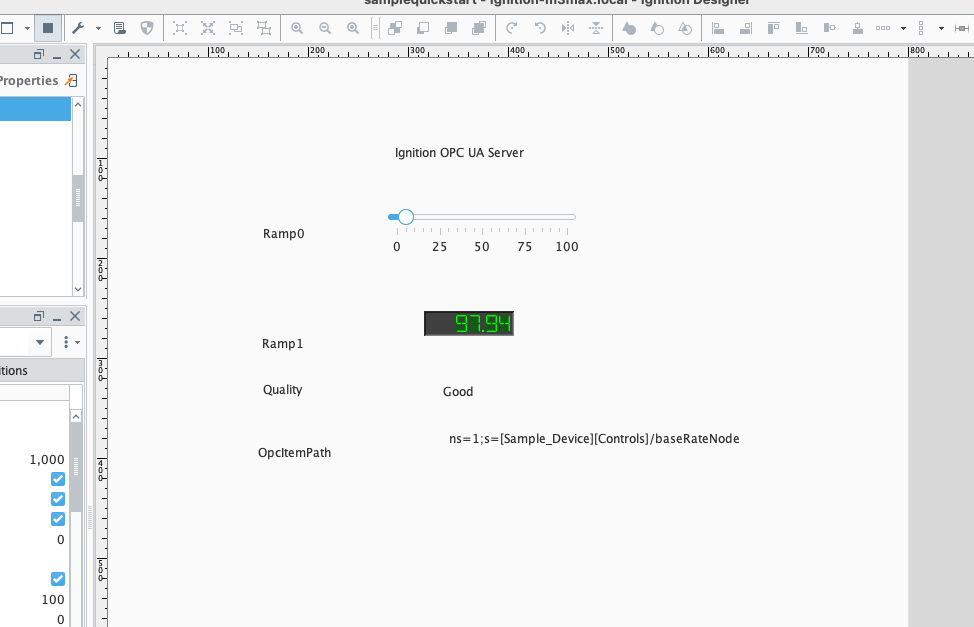

# What is this? 

These are example tasks using the Ignition software

Examples: 

1. Accessing the database and components
2. Button onclick event and popup.
3. Accessing and display device info in the designer


# Random notes

- To restart ignition via CLI: `./ignition.sh`
- Location of DB file : "./data"
- Default gateway: `http://localhost:8088`

# Example 1 (Accessing database and components)

The trial version comes with a SQLite db. You can find the location of the DB file by going to where you have Ignition installed and running: 

        find . -name "*.db"

For me it was located here: `./data/local/quickstart/samplequickstart.db`

To access it in the terminal: 

    > sqlite3 ./data/local/quickstart/samplequickstart.db
    select * from alarm_events;


Below is the GUI that has access to the DB and components
 


Pressing then `Log Events` button runs the following script: 

```python
query = "SELECT * FROM alarm_events ORDER BY id DESC LIMIT 10;"
results = system.db.runQuery(query, "Sample_SQLite_Database")
output = "\n".join([", ".join(map(str, row)) for row in results])
print(output)
```

The output being: 

```logs
245, e2fe09bc-616b-4af9-ab76-d5b50afe5342, prov:Sample_Tags:/tag:Ramp/Ramp3:/alm:High Alarm, Ramp High Alarm, 1, 1, 16, 1732912907407
244, e2fe09bc-616b-4af9-ab76-d5b50afe5342, prov:Sample_Tags:/tag:Ramp/Ramp3:/alm:High Alarm, Ramp High Alarm, 1, 0, 0, 1732912892302
243, 1d229ab6-1aa1-471c-9398-5b424db44c90, prov:Sample_Tags:/tag:Ramp/Ramp3:/alm:High Alarm, Ramp High Alarm, 1, 2, 20, 1732912892302
242, 19cf0559-6504-40ce-99f5-b10602acf871, prov:Sample_Tags:/tag:Ramp/Ramp3:/alm:High Alarm, Ramp High Alarm, 1, 1, 16, 1732912606898
241, 19cf0559-6504-40ce-99f5-b10602acf871, prov:Sample_Tags:/tag:Ramp/Ramp3:/alm:High Alarm, Ramp High Alarm, 1, 0, 0, 1732912591791
240, d9b9be31-4572-4d25-a7c6-1974913e0fda, prov:Sample_Tags:/tag:Ramp/Ramp3:/alm:High Alarm, Ramp High Alarm, 1, 2, 20, 1732912591797
239, c4948a7a-b322-4a17-a7bb-44b79b752af1, prov:Sample_Tags:/tag:Ramp/Ramp3:/alm:High Alarm, Ramp High Alarm, 1, 1, 16, 1732912306891
238, c4948a7a-b322-4a17-a7bb-44b79b752af1, prov:Sample_Tags:/tag:Ramp/Ramp3:/alm:High Alarm, Ramp High Alarm, 1, 0, 0, 1732912292778
237, 6401d582-3520-42d3-8588-ba7bd5013e74, prov:Sample_Tags:/tag:Ramp/Ramp3:/alm:High Alarm, Ramp High Alarm, 1, 2, 20, 1732912292779
236, cfb1acd1-e30d-4bc6-9c7b-940d0de2737b, prov:Sample_Tags:/tag:Ramp/Ramp3:/alm:High Alarm, Ramp High Alarm, 1, 1, 16, 1732912007477
245, e2fe09bc-616b-4af9-ab76-d5b50afe5342, prov:Sample_Tags:/tag:Ramp/Ramp3:/alm:High Alarm, Ramp High Alarm, 1, 1, 16, 1732912907407
```


Pressing the `Print Available Components` logs the components in the UI:

```python
def listComponents(container, depth=0):
    for component in container.getComponents():
        print("{}Name: {}, Type: {}".format("  " * depth, component.name, type(component)))
        if hasattr(component, 'getComponents'):  # Check if the component is a container
            listComponents(component, depth + 1)

# Start with the current container
listComponents(event.source.parent)
```

```logs
Name: Button 1, Type: <type 'com.inductiveautomation.factorypmi.application.components.PMIButton'>
Name: Label, Type: <type 'com.inductiveautomation.factorypmi.application.components.PMILabel'>
Name: LED Display, Type: <type 'com.inductiveautomation.factorypmi.application.components.PMIDigitalDisplay'>
Name: Button, Type: <type 'com.inductiveautomation.factorypmi.application.components.PMIButton'>

```

# Example 2 (button event)

A button with an onClick event that triggers a python script and displays a message in a popup. 



# Example 3 (Display device info)

Display select device information. 

The second example demo shows how to take a mock device and display specific values in the editor. 

Below is a sample device.



Below is the editor with selected values from the sample device.





